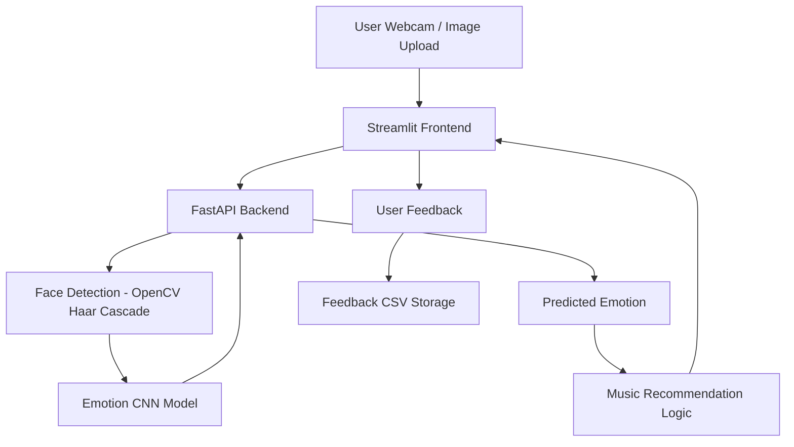

# 🎧 Moodify — AI Mood-Based Music Recommender

Moodify is an end-to-end AI-powered web application that detects a user's facial emotion using deep learning and recommends music based on the detected mood.

The system combines Computer Vision, Deep Learning, and Web Technologies to create a real-time intelligent music recommendation experience.

---

## 🔥 Features

- Facial emotion detection using CNN  
- Face detection before emotion classification (OpenCV Haar Cascade)  
- Webcam-based image capture  
- Real-time emotion prediction  
- Mood-based Spotify playlist recommendation  
- User feedback collection system  
- FastAPI backend  
- Streamlit frontend  
- Modular project structure  
- One-click start & stop automation  

---

## 🧠 Tech Stack

- Python 3.10  
- TensorFlow / Keras  
- OpenCV  
- FastAPI  
- Streamlit  
- NumPy, Pandas  
- Git & GitHub  

---

## 📁 Project Structure

```
Moodify/
│
├── backend/
│   ├── main.py
│   ├── emotion_model.h5
│   └── haarcascade_frontalface_default.xml
│
├── frontend/
│   └── app.py
│
├── model/
│   └── train_emotion_model.ipynb
│
├── data/
│   └── fer2013/
│       ├── train/
│       └── test/
│
├── feedback/
│   └── feedback.csv
│
├── start_moodify.bat
├── stop_moodify.bat
├── requirements.txt
└── README.md
```

---

## 🏗️ System Architecture



---

## 🧠 Model Training Pipeline


---

## ⚙️ Installation

```bash
python -m venv moodenv
moodenv\Scripts\activate
pip install -r requirements.txt
```

---

## ▶️ Run Application

Start everything:

```bash
start_moodify.bat
```

Stop everything:

```bash
stop_moodify.bat
```

---

## 📸 How It Works

1. User captures face using webcam  
2. Face is detected and cropped  
3. CNN predicts emotion  
4. Backend returns emotion  
5. Frontend shows result  
6. Spotify playlist suggested  
7. User provides feedback  

---

## 📈 Future Improvements

- Transfer learning (MobileNet / ResNet)  
- Personalized music recommendations  
- User accounts  
- Cloud deployment  
- Mobile app version  
- Advanced recommender system  

---

## 👨‍💻 Author

RKD
